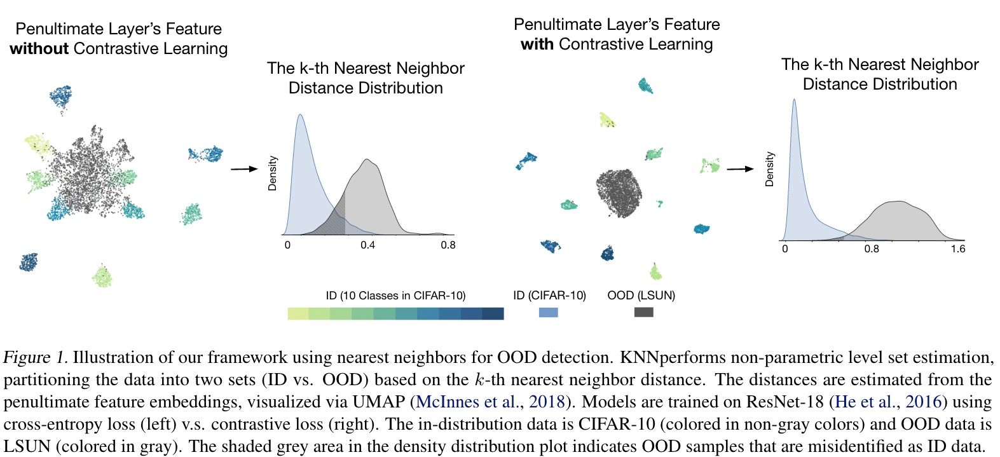
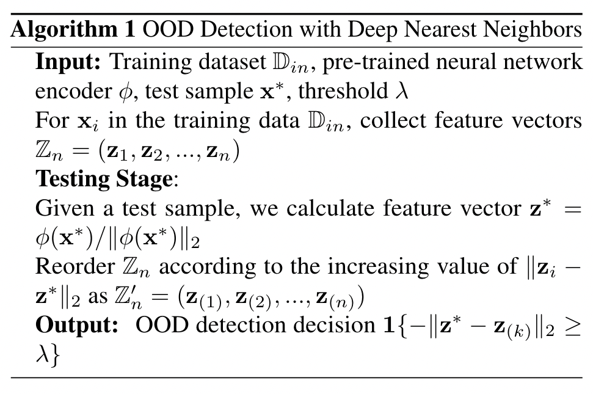

[pdf](https://arxiv.org/pdf/2204.06507.pdf)

This paper describes **the effectiveness of non-parametric nearest-neighbor distance for OoD detection**.
The reason why *this method can be effective for generality and flexibility* is when, unlike other methods, **it does not impose
any distributional assumption**. The authors applied nearest-neighbor OoD detection to several benchmarks and establish superior performance.

## Abstract

> Distance-based methods have demonstared promise, where testing samples are detected as OoD if they are relatively far from in-distribution data. However prior methods impose a strong distributional assumption of the underlying feature space, which may not always hold.

So this paper describes the effectiveness of non-parametric nearest-neighbor distance for OoD detection.

Then, what is the non-parametric nearest-neighbor distance ?

See [K-NN](https://mawjdgus0812.github.io/2022/09/30/K-Nearest-Neighbors-Algorithm/)

## Introduction

> Modern machine learning models deployed in the open world often struggle with Out-of-distribution(OoD) inputs - samples from a different distribution that the network has not been exposed to during training, and therefore should not be predicted at test time.

> A reliable classifier should not only accurately classify known in-distribution samples, but also identify as "unknown" any OoD input.

That is why we need the methods for OoD detection.

> Distance-based methods leverage feature embeddings extracted from a model, and operate under the assumption that the test OoD samples are relatively far away from the ID data.

> However, all these approaches make a strong distributional assumption of the underlying feature space being class conditional Gaussian.

What is the class-conditional Gaussian ??

> In this paper, we challenge the status quo by presenting the first study exploring and demonstrating the efficacy of the non-parametric nearest-neighbor distance for OOD detection. To detect OOD samples, we compute the k-th nearest neighbor (KNN) distance between the embedding of test input and the embeddings of the training set and use a threshold-based criterion to determine if the input is OOD or not.

### Contributions

1. We present the **first study** exploring and demonstrating the efficacy of non-parametric density estimation with nearest neighbors for OOD detection - a simple, flexible yet overlooked approach in literature. We hope our work draws attention to the strong promise of the non-parametric approach, which obviates data assumption on the feature space.

2. We demonstrate the superior performance of the KNN-based method on several OOD detection benchmarks, different model architectures (including CNNs and ViTs), and different training losses. Under the same model trained on ImageNet-1k, our method substantially reduces the false positive rate(FPR@TPR95) by 24.77% compared to a strong baseline SSD+, which uses a parametric approach (i.e., Mahalanobis distance) for detection.

3. We offer new insights on the key components to make KNN effective in practice, including feature normalization and a compact representation space. Our findings are supproted by extensive ablations and experiments. We believe these insights are valuable to the community in carrying out feature research.

4. We provide theoretical analysis, showing that KNN-based OOD detection ca reject inputs equivalent to the Bayes optimal estimator. By modeling the nearest neighbor distance in the feature space, out theory (1) directly connects to our method which also operates in the feature space, and (2) complements our experiments by considering the universality of OOD data.

## Preliminaries

> We consider supervised multi-class classification, where $\mathcal{X}$ denotes the input space and $\mathcal{Y}={1,2,...,C}$ denotes the label space. The training set $\mathbb{D}_{in}=\{(\mathbf{x}_i,y_i)\}^n_{i=1}$ is drawn i.i.d. from the joint data distribution $P_{\mathcal{XY}}$. Let $\mathcal{P}_{\mathbf{in}}$ denote the marginal distribution on $\mathcal{X}$. Let $f:\mathcal{X}\rightarrow{\mathbb{R}^{\|\mathcal{Y}\|}}$ be a neural network trained on samples drawn from $P_{\mathcal{XY}}$ to output a logit vector, which is used to predict the label of an input sample.

> ### Out-of-distribution detection When deploying a machine model in the real world, a reliable classifier should not only accurately classify known in-distribution (ID) samples, but also identify as "unknown" any OOD input. This can be achieved by having an OOD detector, in tandem with the classification model $f$.

> OOD detection can be formulated as a binary classification problem. At test time, the goal of OOD detection is to decide whether a sample $\mathbf{x}\in{\mathcal{X}}$ is from $\mathcal{P}_{\mathbf{in}}$ (ID) or not (OOD). The decision can be made via a level set estimation:

$G_{\lambda}(x)=\begin{cases}\mathbf{ID}&S(\mathbf{x})\geq\lambda\\\mathbf{OOD}&S(\mathbf{x})\lt\lambda\end{cases}$

> where samples with higher scores $S(\mathbf{x})$ are classified as ID and vice versa, and $\lambda$ is the threshold. In practice, OOD is often defined by a distribution that simulates unknowns encountered during deployment time, such as samples from an irrelevant distribution whose label set has no intersection with $\mathcal{Y}$ and therefore should not be predicted by the model.

## Deep Nearest Neighbor for OOD detection

이 논문의 핵심 내용들에 대해 설명하는 장이다. 논문에서 사용된 방법은 deep $k$-Nearest Neighbor (KNN) for OOD detection에 대해 설명한다.

위 그림이 논문의 저자들이 제안하는 방법을 시각화 한 figure이다. 이는 high level에서 거리 기반의 방법으로 분류된다. 거리기반 방법들은 모델로부터 추출된 특징 임베딩을 사용한다 그리고 테스트 OOD 샘플들이 ID 샘플들보다 상대적으로 멀리 떨어져 있을것이라는 가정을 사용한다. 이전의 거리기반 OOD 방법들은 *parametric density estimation*을 사용하였고, *feature embedding space as a mixture of multivariate Gaussian distributions*로 모델링하였다. 그러나 이러한 방법들은 *learned feature space*에 대한 강한 분포 가정을 필요로하지만, 항상 유지되는 것이 아니다.

이 논문에서는 이런 분포 가정이 필요한 방법들 대신에 *non-parametric density estimation using nearest neighbors* for OOD detection의 유효성에 대해 탐구한다. 간단함에도 불구하고 KNN접근법은 시스템적으로 연구되거나 최근의 OOD detection 논문들과 함께 비교되지 않았다.

> Specifically, we compute the k-th nearest neighbor distance between the embedding of each test image and the training set, and use a simple threshold-based criterion to determine if an input is OOD or not. 

> Importantly, we use the normalized penultimate feature $\mathbf{z}=\phi(\mathbf{x})/\|\|\phi(\mathbf{x})\|\|_2$ for OOD detection, where $\phi:\mathcal{X}\rightarrow \mathbb{R}^m$ is a feature encoder. Denote the embedding set of training data as $\mathbb{Z}_n=(\mathbf{z_1,z_2,...,z_n}).$ During testing, we derive the normalized feature vector $\mathbf{z}^\star$ for a test sample $\mathbf{x}^\star$, and calculate the Euclidean distances $\|\|\mathbf{z}_i-\mathbf{z}^\star\|\|_2$ with respect to embedding vectors $\mathbf{z}_i\in\mathbb{Z}_n.$ We reoder $\mathbb{Z}_n$ according to the increasing distance $\|\|\mathbf{z}_i-\mathbf{z}^\star\|\|_2$. Denote the reordered data sequence as $\mathbb{Z}^\prime_n=(\mathbf{z_{(1)},z_{(2)},...,z_{(n)}}).$ The decision function for OOD detection is given by:

$G(\mathbf{z}^\star;k)=\mathbf{1}\{-r_k(\mathbf{z}^\star)\geq{\lambda}\}$,

where $r_k(\mathbf{z}^\star)=\|\|\mathbf{z}^\star-\mathbf{z}_{(k)}\|\|_2$ is the distance to the $k$-th nearest neighbor ($k$-NN) and $\mathbf{1}\{\cdot\}$ is the indicator function. The threshold $\lambda$ is typically chosen so that a high fraction of ID data ($e.g.$, 95%) is correctly classified. The threshold does not depend on OOD data.

